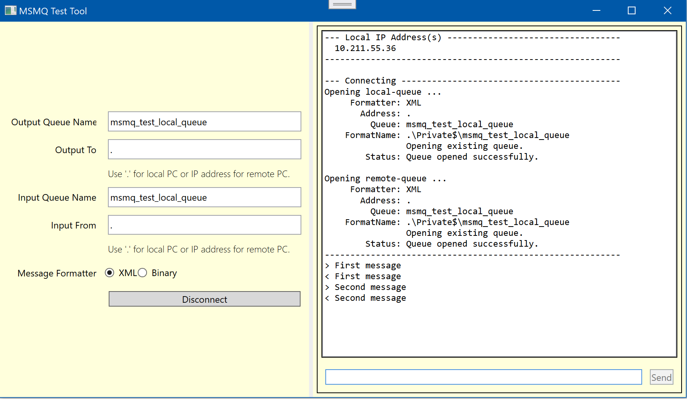

# MSMQTest - Microsoft Message Queue Test Application

This simple dialog application is useful for testing MSMQ connectivity on
networked Windows computers.

It connects to two message queues one to send messages and the other to receive messages.

Then it provides a capability to send and receive messages.

If any errors are enocuntered, they are displayed in the log windows.
